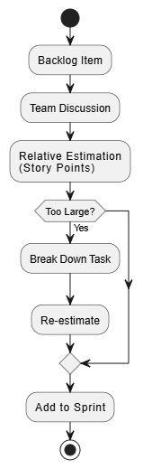

# Task Estimation in Scrum

## Purpose of this section

In a startup, poor task estimation can cause overloaded sprints, unpredictable delivery, team frustration, and rushed work that could lead to increased chance of defects reaching production.

The purpose of this section is to define an approach to estimation so that engineers plan work in the same way and make better decisions about scope, effort, and risk.

Estimation isn't predicting the future perfectly. It's a tool to support better planning, better conversations, and more reliable delivery.

---

## Why task estimation matters

When engineers estimate work differently, the team cannot compare tasks or plan sprints effectively. Estimation helps the team understand the size, complexity, and risk of work before starting.

It also highlights hidden effort such as testing, debugging, documentation, and code review. Without this, tasks are often underestimated.

Estimation improves communication by forcing teams to discuss assumptions, dependencies, and uncertainty early. This can reduce the risk of unclear or overly complicated work entering a sprint.

Estimates should support planning and not be used to measure individual performance.

---

## Good practices to follow

### Estimate as a team

Estimation should always involve multiple team members. Different engineers bring different perspectives and can identify risks or missing work that others may overlook.

---

### Use relative estimation

Relative estimation (such as story points) compares tasks based on size and complexity rather than time.

This is better than time-based estimation because software tasks often include unknowns. Predicting exact hours creates false confidence, compared to relative estimation which reflects uncertainty more realistically.

---

### Break work into smaller tasks

Large tasks are difficult to estimate accurately. Breaking work into smaller pieces improves clarity and reduces risk.

---

### Discuss uncertainty openly

Uncertainty should be highlighted and not hidden. Honest discussions lead to better planning and more realistic expectations.

---

### Learn from previous sprints

Estimation should improve over time. Teams should review previous estimates and understand where and why inaccuracies occurred.

---

## Bad practices to avoid

### Estimating alone

Individual estimates often miss important details and lead to inconsistent results.

---

### Treating estimates as deadlines

Estimates are planning tools which are not commitments. Treating them as fixed deadlines creates pressure and encourages unrealistic estimates.

---

### Estimating unclear work

Tasks that are not well understood should not be estimated until they are clarified or broken down.

---

### Ignoring hidden work

Failing to include testing, debugging, and review leads to consistent underestimation.

---

### Using estimates to judge individuals

Using estimation as a performance metric leads to defensive behaviour and poor-quality estimates.

---

## Real-world issues teams face

A common problem in software teams is hidden work. A feature may appear small during planning but once development begins, additional effort is required for edge cases, testing, and review.

For example, a task estimated as a one-day job may expand due to unclear requirements or unexpected complexity. This leads to missed sprint goals even when the initial implementation seemed simple.

Another issue is overconfidence. Engineers often estimate based on best-case scenarios, ignoring interruptions and unknowns. This is why relative estimation is generally more reliable than time-based estimation.

---

## Recommended company approach

At this company, task estimation should follow these rules:

- Estimation must be done collaboratively  
- Tasks should be estimated using relative sizing (not exact time)  
- Large tasks must be broken down before entering a sprint  
- Uncertainty must be discussed openly  
- Estimates must not be used to evaluate individual performance  
- Teams should regularly review and improve their estimation process  

Following this approach will improve consistency, reduce unpredictability, and support better sprint planning.

---

## Further reading

- https://www.scrum.org/resources/blog/why-estimation-hard  
- https://www.atlassian.com/agile/project-management/estimation  
- https://www.mountaingoatsoftware.com/blog/story-points  
- https://www.thoughtworks.com/insights/blog/agile-estimation-antipatterns  
- https://martinfowler.com/articles/noestimates.html  